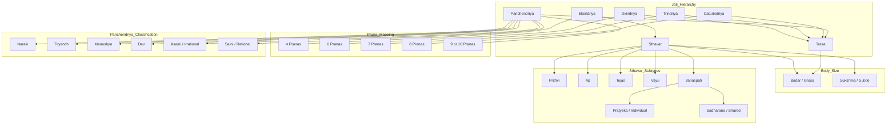

## Vision

This project models core Jain philosophical concepts using Object-Oriented Design and clean system architecture.

As I learn Jainism, I will continuously extend this codebase to represent concepts such as Lok, Akash, Jeev, Pudgal, and their properties, relations, and behaviors.  
The goal is to build a reusable Java backend that can power educational UIs, visualization tools, and game-like learning experiences.

## Design Goals

- Extensible domain model that grows with learning
- Strong separation of concerns (Domain, Application, Infrastructure)
- Backward-compatible evolution of concepts and rules
- Explainable outputs for educational use
- Reusable APIs for future UI clients

## Architecture Principles

- Domain-first modeling of Jain concepts
- Interfaces and composition over rigid inheritance
- Testable business logic independent of frameworks
- Incremental adoption of design patterns where they fit naturally

## Planned Pattern Usage

This project will adopt design patterns pragmatically as complexity grows:

- Strategy for concept classification and explanation
- Factory/Builder for safe object creation
- Specification for doctrinal/rule composition
- Visitor for alternate output representations
- State for lifecycle-oriented simulations
- Observer/Event-driven hooks for UI and analytics integration

## Long-Term Outcome

A robust and evolving Java service that:
1. Encodes Jain concepts as a structured knowledge model
2. Supports learning-oriented simulations and explanations
4. Acts as a hands-on system design and OOP learning project

## Core Domain Visualization

